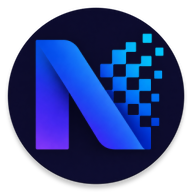

# Nexus Notes

<p align="center">
  
</p>

<p align="center">

A modern, secure and minimal Android Notes application built using **Kotlin**, **Jetpack Compose**, **MVVM**, **Room Database**, **Hilt Dependency Injection**, and **Material 3**.

Designed with simplicity, performance and clean architecture in mind.

</p>

---

# Table of Contents

* About Nexus Notes
* Features

  * Note Management
  * Smart Search
  * Trash Management
  * Multi Selection
  * Sharing
  * Appearance
  * Security
  * Settings
  * About
* Tech Stack
* Architecture
* Project Structure
* Getting Started
* Application Flow
* Security Module
* Sharing Module
* Theme System
* Local Storage
* Performance
* Current Version
* Current Development Status
* Roadmap
* Design Principles
* Development Highlights
* Known Limitations
* Developer
* License
* Acknowledgements

---

# About Nexus Notes

Nexus Notes is a modern offline-first note taking application developed for Android using the latest Jetpack libraries.

The goal of this project is to provide a beautiful, lightweight and secure notes experience while following production-level Android development practices.

Unlike traditional note applications, Nexus Notes focuses on:

* Clean UI
* Smooth User Experience
* Offline Performance
* Secure Notes
* Modern Android Architecture
* Modular Codebase
* Easy Future Scalability

This project is actively being developed and continuously improved.

---

# Features

## Note Management

* Create Notes
* Edit Existing Notes
* Auto Save Notes
* Instant Update
* Beautiful Material Design
* Last Edited Information
* Empty State Screen

---

## Smart Search

* Real-time Searching
* Search by Title
* Search by Content
* Instant Filtering
* Dynamic Search UI

---

## Trash Management

* Move Notes to Trash
* Restore Deleted Notes
* Undo Delete Snackbar
* Permanent Deletion Support (Architecture Ready)

---

## Multi Selection

* Long Press Selection
* Multiple Notes Selection
* Select All
* Deselect All
* Delete Multiple Notes
* Share Multiple Notes

---

## Sharing

### Share Notes as Text (.txt)

* Export Selected Notes
* Single or Multiple Notes
* Android Share Sheet Support
* WhatsApp
* Gmail
* Bluetooth
* Quick Share
* Drive
* Any Sharing Application

### Share Notes as PDF

* PDF Export
* Multiple Notes Support
* Header & Footer Branding
* Word Wrapping
* Professional Formatting
* Share Through Android Share Sheet

> PDF rendering engine is currently under continuous improvements.

---

## Appearance

* Material 3 Design
* Dynamic Theme Selection
* Light Theme
* Dark Theme
* System Default Theme

---

## Security

### Current Features

* PIN Setup
* Change PIN
* Disable PIN
* Locked Note Architecture
* Secure PIN Verification Screen

### Upcoming Improvements

* Biometrics Authentication
* Unlock Before Opening Protected Notes
* Advanced Security Layer

---

## Settings

* Theme Selection
* Security Settings
* Privacy Policy
* About Nexus Notes
* Clean Material UI

---

## About

Inside the application users can view:

* About This App
* Developer Journey
* Current Version
* Privacy Information

---

# Tech Stack

| Technology         | Usage                |
| ------------------ | -------------------- |
| Kotlin             | Programming Language |
| Jetpack Compose    | UI Toolkit           |
| Material 3         | UI Components        |
| MVVM               | Architecture         |
| Room Database      | Local Storage        |
| Kotlin Flow        | Reactive Data        |
| Coroutines         | Async Programming    |
| Hilt               | Dependency Injection |
| Navigation Compose | Navigation           |
| FileProvider       | Secure File Sharing  |
| Android PDF API    | PDF Export           |
| Git & GitHub       | Version Control      |

---

# Architecture

The project follows Google's recommended modern Android architecture.

```text
Presentation (Jetpack Compose UI)
            │
            ▼
ViewModel (MVVM)
            │
            ▼
Use Cases (Business Logic)
            │
            ▼
Repository
            │
            ▼
Room Database
```

The application follows **Clean Architecture** principles with proper separation of concerns.

---

# Project Structure

```text
NexusNotes
│
├── app
│
├── core
│   ├── navigation
│   ├── share
│   ├── theme
│   └── utils
│
├── data
│   ├── local
│   ├── repository
│   └── datasource
│
├── domain
│   ├── model
│   ├── repository
│   └── usecase
│
├── presentation
│   ├── home
│   ├── editor
│   ├── trash
│   ├── settings
│   ├── security
│   ├── auth
│   ├── about
│   └── components
│
└── di
```

The project follows a modular structure that keeps business logic, UI, navigation and data layers separated for better maintainability and scalability.

---

# Getting Started

## Requirements

* Android Studio Narwhal or above
* JDK 17
* Android SDK 35
* Gradle 8+
* Git

---

## Open Project

Open Android Studio.

```text
File
    ↓
Open
    ↓
Select NexusNotes Folder
```

Allow Gradle Sync to complete.

---

## Run Application

Connect an Android device or start an emulator.

Click:

```text
Run ▶
```

The application should launch successfully.

---

# Application Flow

```text
Splash
      │
      ▼
Home Screen
      │
      ├─────────────► Search
      │
      ├─────────────► Settings
      │                   │
      │                   ├── Appearance
      │                   ├── Security
      │                   ├── Privacy Policy
      │                   └── About Nexus Notes
      │
      ├─────────────► Trash
      │
      ├─────────────► About This App
      │
      └─────────────► Editor
```

---

# Security Module

Current implementation includes:

* PIN Management
* Change PIN
* Disable PIN
* Verification Screen
* Locked Note Architecture

### Upcoming Improvements

* Fingerprint Authentication
* Biometric Prompt
* Unlock Before Opening Protected Notes

---

# Sharing Module

Nexus Notes allows exporting selected notes in multiple formats.

### Supported Formats

* TXT
* PDF

### Share Targets

* WhatsApp
* Gmail
* Google Drive
* Bluetooth
* Nearby Share / Quick Share
* Telegram
* Any Android Share Compatible App

Sharing implementation follows a modular architecture.

```text
Home Screen
      │
      ▼
Share Bottom Sheet
      │
      ▼
Share Coordinator
      │
      ├────────► Text Exporter
      │
      └────────► PDF Exporter
                     │
                     ▼
             Note Share Manager
                     │
                     ▼
           Android Share Sheet
```

---

# Theme System

Users can switch between:

* Light Theme
* Dark Theme
* System Default Theme

The selected theme is saved locally and automatically restored when reopening the application.

---

# Local Storage

Nexus Notes stores all notes locally using Room Database.

* No internet connection is required.
* No cloud account is required.
* All data remains on the user's device.

---

# Performance

Designed with performance in mind.

* Reactive UI using StateFlow
* Kotlin Coroutines
* Efficient Room Queries
* LazyColumn Rendering
* Material 3 Components
* Clean MVVM Architecture
* Minimal Memory Usage
* Offline First

---

# Current Version

| Property    | Value              |
| ----------- | ------------------ |
| Version     | 1.0.0              |
| Status      | Active Development |
| Platform    | Android            |
| Minimum SDK | 24                 |
| Target SDK  | 35                 |

---

# Current Development Status

The project is under active development and has reached approximately **91% completion**.

Implemented modules are stable and production-oriented. The remaining work primarily focuses on security enhancements, PDF rendering improvements and final application polishing.

| Module                      | Status      |
| --------------------------- | ----------- |
| Notes Management            | Complete    |
| Search                      | Complete    |
| Trash                       | Complete    |
| Multi Selection             | Complete    |
| Settings                    | Complete    |
| Theme System                | Complete    |
| PIN Management              | Complete    |
| TXT Sharing                 | Complete    |
| APK Sharing                 | Complete    |
| PDF Sharing                 | In Progress |
| Locked Notes Authentication | In Progress |
| Biometric Authentication    | Planned     |

---

# Roadmap

## Version 1.0

* Complete PDF Rendering Engine
* Locked Notes Authentication
* Biometric Authentication
* PDF Formatting Improvements
* Performance Optimization
* Final UI Polish
* Bug Fixes

---

## Future Releases

Planned features after Version 1.0 include:

* Rich Text Notes
* Image Attachments
* Voice Notes
* Labels & Categories
* Note Pinning
* Archive
* Cloud Backup
* Markdown Support
* Widgets
* Tablet Optimization
* Multi-window Support

---

# Design Principles

The application is developed around a few core principles:

* Simplicity
* Performance
* Clean Architecture
* Offline First
* Privacy Focused
* Minimal User Interface
* Maintainable Codebase
* Scalable Project Structure

---

# Development Highlights

Some implementation highlights include:

* Jetpack Compose based UI
* MVVM Architecture
* Room Database
* Kotlin Coroutines
* Kotlin Flow
* Dependency Injection using Hilt
* Material Design 3
* Modular Sharing System
* Reusable Navigation Components
* Secure File Sharing using FileProvider

---

# Known Limitations

The current version has a few planned improvements:

* PDF export does not yet support automatic page continuation for extremely long notes.
* Locked notes authentication flow is under development.
* Biometric authentication is planned.
* Rich text formatting is not yet supported.

These features are part of the active roadmap.

---

# Developer

**Utsav Shrivastav**

Computer Science Engineering Student

Android Developer

Focused on building modern Android applications using Kotlin and Jetpack Compose while following clean architecture and scalable development practices.

### LinkedIn

https://www.linkedin.com/in/shriutsav5246

---

# License

This project is licensed under the MIT License.

You are free to use, modify and distribute the project under the terms of the license.

---

# Acknowledgements

This project makes use of modern Android development libraries and follows recommendations from:

* Android Developers
* Kotlin
* Jetpack Compose
* Material Design
* Room Database
* Hilt
* AndroidX

---

<p align="center">

If you found this project useful, consider giving the repository a ⭐.

It helps support the project and encourages future development.

</p>
